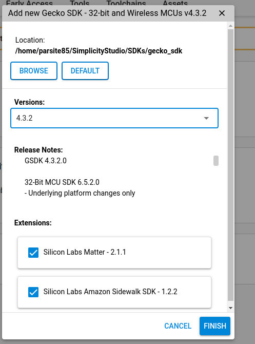
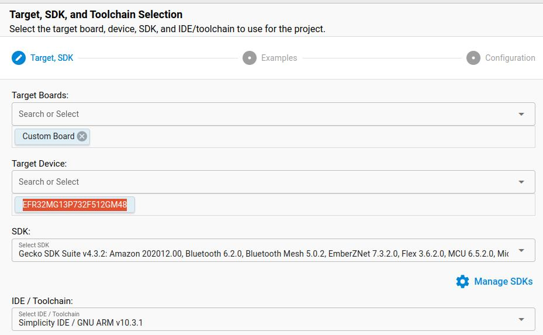
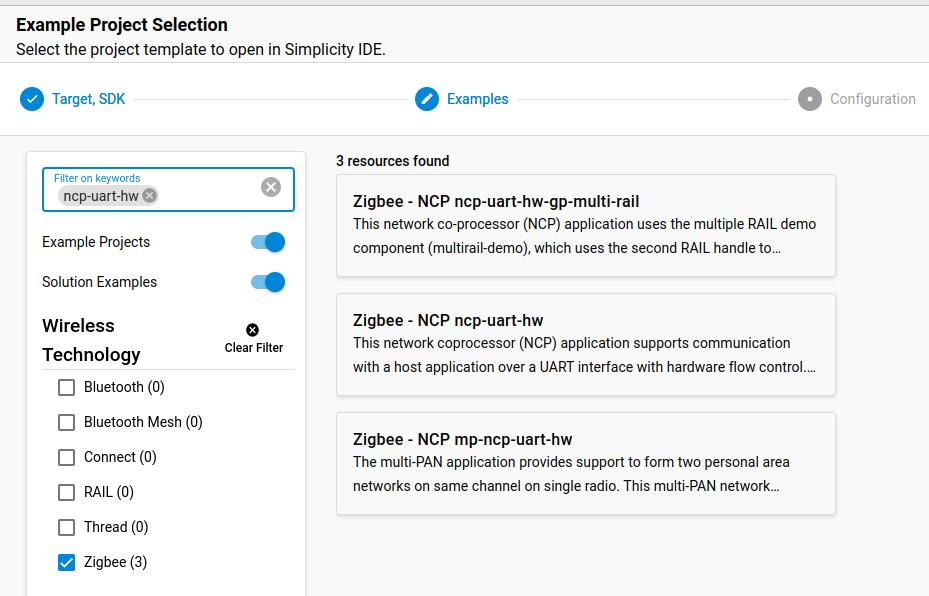
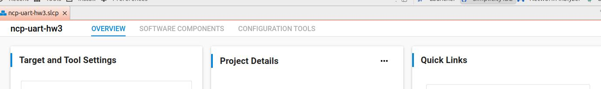
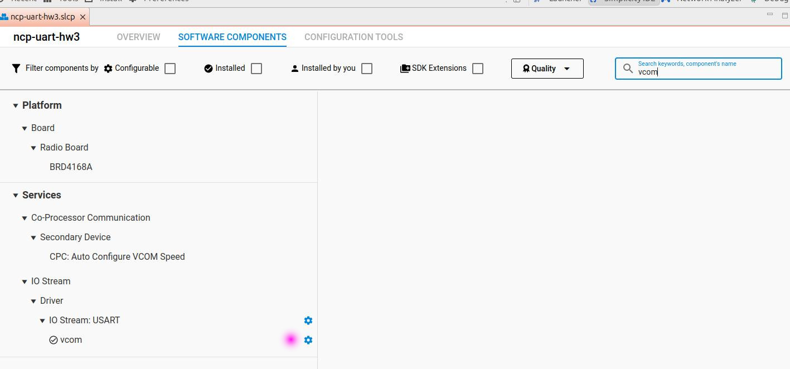
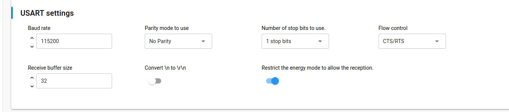
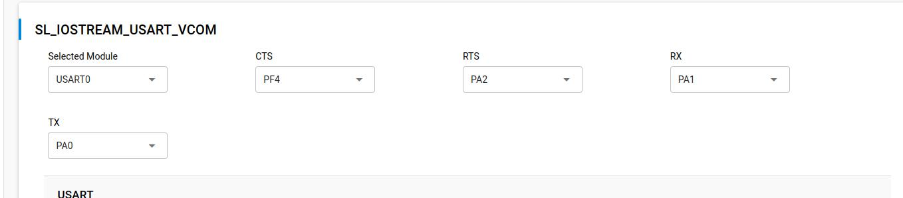
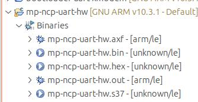

# Build by Zigbee Module firmware by yourself

You can omit this section if you have decided to use binary  
Download and install Simplicity Studio v 5 from [Silicon Labs Webpage](https://www.silabs.com/developers/simplicity-studio)
This is eclipse based IDE. Start Simplicity studio.  
**You dont need to register, you can skip this**  
You need to install proper SDK.  
  
  

Create a new project (File -> New -> Silicon Labs Project Wizard )  
Do not select target board. Only select Target device to: EFR32MG13P732F512GM48. Next select SDK and IDE  
  
Next, you need to use existing Zigbee example. Find: "ncp-uart-hw"  
  
Continue creating with default settings.  
Next, in file list, double click on *.sclp file. It will open Overview section of this file.  
Click on "SOFTWARE COMPONENTS"  
  
Type vcom in search box  
  
Click on bluee gear at "vcom" line  
  

Here are UART settings. We can use 57600 with software control flow or 115200 with hardware control flow  
**NOTE:** If you are planning to use "wired" wersion of gateway, using UART connected to PC then for baudrate 57600 with software control flow you need only 
two wires to be connected to Zigbee module. If you want to use 115200 rate then you need to connect two additonal wires to handle CTS RTS signalling.
Next, you need to setup connections to UART.
Reference: [Tuya Webpage](https://developer.tuya.com/en/docs/iot/wrg1-datasheet?id=K97rig6mscj8e)  
  
Next, click Project -> Build Project.
You should get binaries.

  
Done,  
You can flash binaries to TYZS (Zigbee) module  