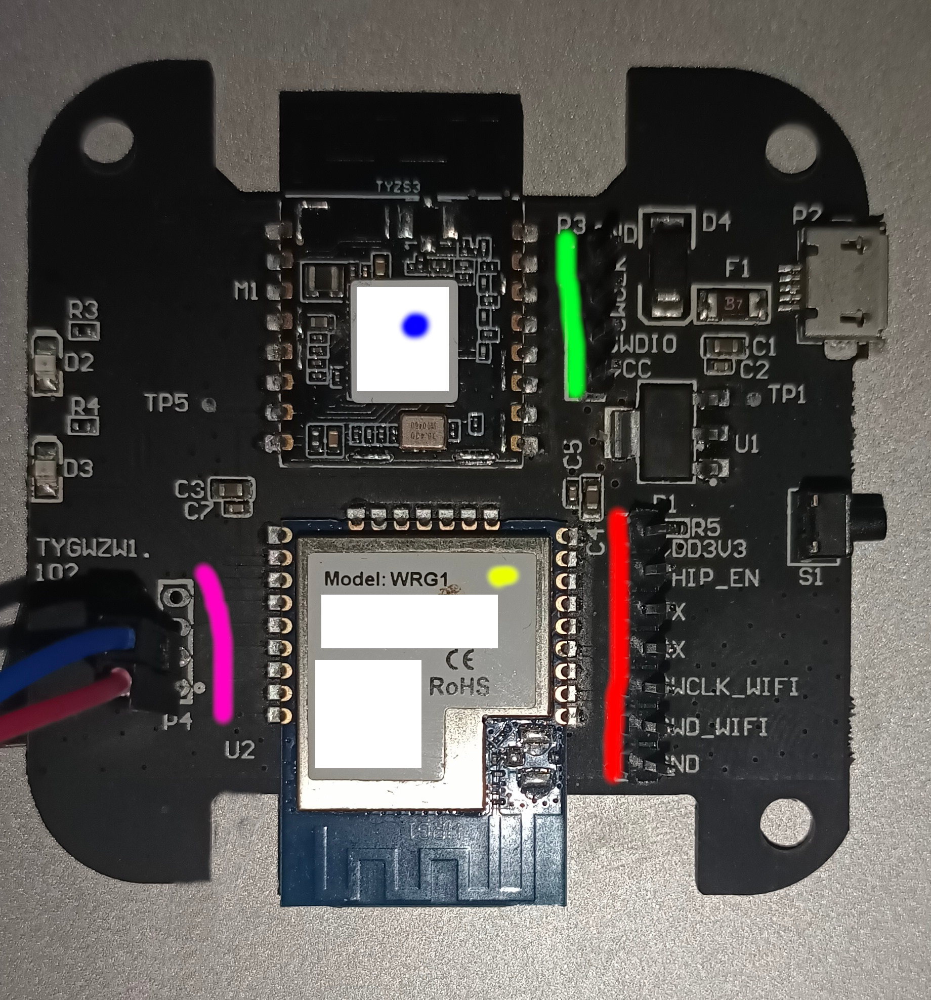

# Tuya TYGWZW Hacking Guide

## Intro
Some time ago i have bought a couple of Tuya gateways for home automation. I had to use some simple solution which will work
out of box with some simple automation rules. After some time my requirements has been changed and I found Home Assistant is
a perfect solution for me. I have put my gateways aside and bought a other hardware for Home Assistant. Everything is working
fine for me with my current setup.

Last time i had some spare time that i wanted to dedicate for some usefull thing. I thought that i could bring to these gateways
second life instead of putting them into dumpster. One project related Ethernet based gateway is already ongoing and some progress
also has been made.

This, second project, it might be a breakthrough. I did not saw that anyone else did such thing so i have decided to take a look
closer at wireless gateway.

Also i wrote a detailed instruction. I hope I'll learn some people and also inspire to go further.

**WARNING**: I have provided the way how to customize HW. I have not provided here the way how to do a backup of FW inside it.
             So for now this is one way ticket.

## Our hero:


There are many clones of this device. Basically, Tuya have shared a reference project which can be found there:
[Tuya Wireles Gateway Reference](https://developer.tuya.com/en/docs/iot/zigbee-gateway?id=K9wuit65kj3et)

I have marked some important parts on picture
- Yellow - "Main CPU module". It contains Realtek 8711M module. This CPU is the main CPU. Responsible for setting up WLAN,
           communication with Tuya servers and Forwarding data between WRG module (described in next point) and Tuya servers.
           Unfortunately, Realtek is not sharing all the details regarding this CPU unless you get their NDA.
           Fortunately, they have provided a SDK with some examples for open source community.
           There is no Linux OS here. Everything is in Free RTOS  
           So, generally speaking they did something similar to ESP module.
- Blue - "Zigbee module". This module has EFR32MG13P732F512GM48 CPU module made by Silicon Labs. Silicon labs has great community,
         also there is better documentation even with Videos. This module is responsible for Zigbee communication.
         I`m not sure what software is running here, it might be RTOS or even something else.
         Thats because while doing investigation i accidentally eareased flash and i was unable to check it.
         It sends all Zigbee data to Main (Yellow) CPU via UART.

- Green - In my case i had to solder goldpins. This is port to connect SWD debugger to EFM Zigbee CPU.
- Red - In my case i had to solder goldpins. This connector contains following pins:
    - TX, RX - UART - communication between Main CPU and Zigbee module. 
    - SWD_CLK, SWD_WIFI - SWD debugger ports
- Pink - Log console for "Main CPU" module. This is "Main CPU module" additional UART which prints logs. 
         With Tuya software it is printing some stuff. There is no CLI there (but when you enter a longer line
         you will get some info that line is to large.

There is no really anything to "hack" rather than implement some stuff and load you own custom firmeware.

## Requirements:

To be able to customize firmware on gateway you need to:
 - Solder connectors to Green, Red and Pink holes in PCB
 - Have some Linux Skills
 - Get some SWD debugger. Originally, Realtek and Silicon Labs are using J-Link. You can buy Chinese copy and try.  
   I was using **ST-LInk v2** debugger - something about $3
 - UART<>USB device. You can buy it about $1-3

Note: While doing this customisation i was using Ubuntu 23.10. Some adaptaion might be needed for different env.

## The procedure

 There are two ways of customisation.
 - "Wireless mode" - In this case we wil use both modules and connect using wireless network. So for wireless mode  
   we will need to flash both modules.
 - "Wired mode" - In this case we will use only Zigbee module and UART and we can connect gateway directly to PC via UART<>USB.  
    In this case we need to flash only Zigbee module

## SW for Zigbee Module
Together with Simplicity Studio there is Zigbee Stack provided in one of example projects.
**This software will basically send EZSP messages to our Zigbee2MQTT using direct UART connection or using UART over TCP wireless connection.**

You can:  
 build yourself - [Tutorial](BUILD_TYZS.md).  
 or  
 download binary file from [here](flash_tyzs/mp-ncp-uart-hw.bin).

## Flashing Zigbee Module (TYZS)

For this step you need download files from flash_tyzs.  
Connect ST-Link v2 to your PC.  
Install latest version of **openocd** and **gdb-multiarch** (you can use arm dedicated version of gdb as well) package.  
Open terminal and enter: `openocd -f interface/stlink-v2-1.cfg -f target/efm32.cfg`. It will start debug server for GDB  
Next, open second terminal and type: `gdb-multiarch --command=flash.gdb`  
Script `flash.gdb` will erase flash data and write new firmware.

## SW for Main CPU Module

I made changes on top of original SDK. Basically extended TCP stream example - added UART over TCP. 
This is needed to be able to communicate with Zigbee2MQTT (i have followed this path) or directly Home Assistant.
So the software is waiting for incomming communication from Zigbee2MQTT on port 80. Once is connected, it will forward all
UART data in both directions. There is simple buffering mechanism to avoid sending small amount of data per packet.

We will be using original Realtek SDK for Ameba with my modifications:  
**Install all required files for i386 running i386 programs.** We ill use built in ARM GCC toolchain/compiler.  
Clone [https://github.com/parasite85/rtl_firmware](https://github.com/parasite85/rtl_firmware) repo  
Next go to dir: `rtl_firmware# cd project/realtek_ameba1_va0_example/GCC-RELEASE/`  
Change debugger to openocd: `export GDB_SERVER=openocd && make setup`  
Compile the project: `make`  
  
###Time to flash Main CPU image.  
  
Open terminal and go to dir `rtl_firmware# cd project/realtek_ameba1_va0_example/GCC-RELEASE/`  
Next, run script `run_openocd.sh`. It will create debug server for GDB.
Open second terminal and go to dir: `rtl_firmware# cd project/realtek_ameba1_va0_example/GCC-RELEASE/`  
In second terminal run: `make flash`. This will load simple binary to realtek SRAM (no full source) and perform flash.  
  
Once it finish. We can attach our USB UART to LOG-UART - See pink color on my image.
  
## Setting up WIFI on Main CPU

With proper firmware loaded on both, Main CPU and Zigbee modules, attach your UART to LOG-UART port and connect to power supply.

**NOTE:** I noticed that some UART<>USB adapters are not working properly when starting from BOOT ROM, they are working when you load firmware to Main CPU Module to ram (make ramdebug).
          These adapters are not printing information from boot ROM.
So this will be not visible.
```
ROM Version: 0.3
Build ToolChain Version: gcc version 4.8.3 (Realtek ASDK-4.8.3p1 Build 2003) 
```

If you have no text on your console, change adapter.


If everything is ok. You should see following text:
```
=========================================================

ROM Version: 0.3

Build ToolChain Version: gcc version 4.8.3 (Realtek ASDK-4.8.3p1 Build 2003) 

=========================================================
Check boot type form eFuse
SPI Initial
Image1 length: 0x41fc, Image Addr: 0x10000bc8
Image1 Validate OK, Going jump to Image1

BOOT from Flash:YES

===== Enter Image 1 ====
SDR Controller Init

load NEW fw 0
Flash Im2:Addr 0xb000, Len 353992, Load to SRAM 0x10006000
Im3 length: 0x6300, Im3 Addr: 0x30000000
Im2 Sign: RTKWin, InfaStart @ 0x10006189 
===== Enter Image 2 ====
#!!!!!!!!!!!!!!!! Test NEW !!!!!!!!!!!!!!!!!!!!!!
interface 0 is initialized
interface 1 is initialized

Initializing WIFI ...
Start LOG SERVICE MODE

# [FAST_CONNECT] Fast connect profile is empty, abort fast connection

WIFI initialized

init_thread(53), Available heap 0x5ed0
#
#
#
#
#
Example: socket tx/rx 1

```

This means your firmware has been loaded. Now time to configure your network.
Fortunately, there is CLI. Type `help`
```
# ATW0=Mynet
[ATW0]: _AT_WLAN_SET_SSID_ [Mynet]

[MEM] After do cmd, available heap 29256


# ATW1=pass123
[ATW1]: _AT_WLAN_SET_PASSPHRASE_ [pass123]

[MEM] After do cmd, available heap 29256

# ATWC
[ATWC]: _AT_WLAN_JOIN_NET_

Joining BSS by SSID Mynet...

RTL8195A[Driver]: set ssid [Mynet] 

RTL8195A[Driver]: rtw_restruct_sec_ie[3770]: no pmksa cached 

RTL8195A[Driver]: start auth to xx:xx:xx:xx:xx:xx

RTL8195A[Driver]: auth alg = 2

RTL8195A[Driver]: 
OnAuthClient:algthm = 0, seq = 2, status = 0, sae_msg_len = 0

RTL8195A[Driver]: auth success, start assoc

RTL8195A[Driver]: association success(res=1)

RTL8195A[Driver]: ClientSendEAPOL[1559]: no use cache pmksa 

RTL8195A[Driver]: set pairwise key to hw: alg:4(WEP40-1 WEP104-5 TKIP-2 AES-4)

RTL8195A[Driver]: set group key to hw: alg:4(WEP40-1 WEP104-5 TKIP-2 AES-4) keyid:1

Connected after 3049ms.

Interface 0 IP address : 192.168.XXX.XXX
 wlan_wrtie_reconnect_data_to_flash():not the same ssid/passphrase/channel/offer_ip, write new profile to flash

Got IP after 3909ms.


[MEM] After do cmd, available heap 25600
```
  
Intresting part: `Interface 0 IP address : 192.168.XXX.XXX`

## Configuration for zigbee2mqtt
You need to put this address to zigbee2mqtt or home assistant in proper plugin/module
```yaml
serial:
  adapter: ezsp
  baudrate: 115200
  port: tcp://192.168.68.113:80
  rtscts: false
```


You are connected to network.
